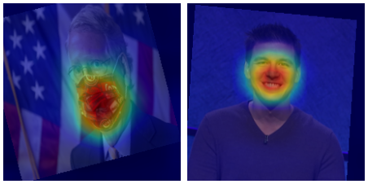
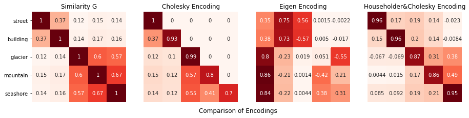
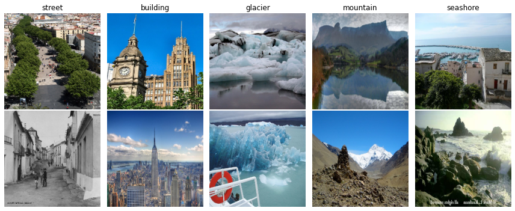
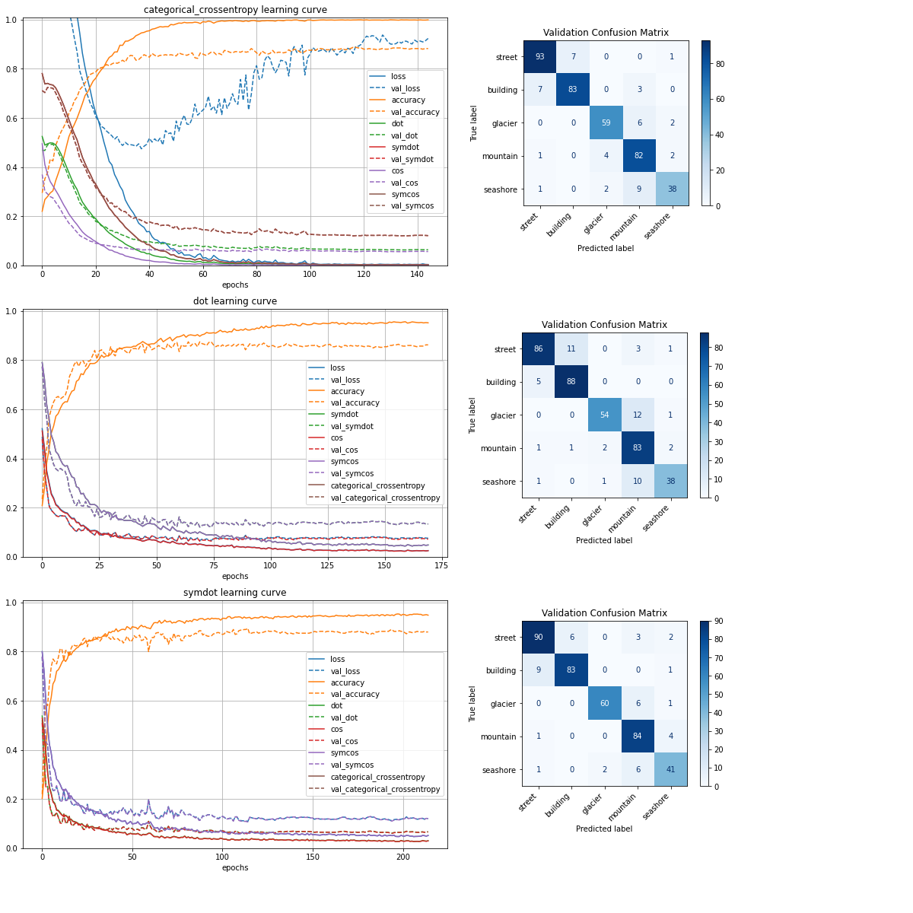
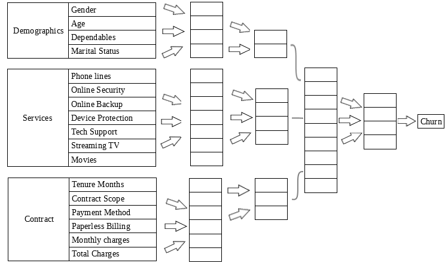

# fancy-neural-networks
Ideas for going beyond the typical use of Artificial Neural Networks

## GradCAM

I train an image classifier for faces wearing a mask from google search queries. Less than 100 images and 7 epochs are enough thanks to **data augmentation **and **knowledge transfer**. Then, we perform a gradient activation map to point out where the Neural Network is looking to make its decision.

## Similarity on categorical variables

I propose recipes on how to treat a categorical variable when we have a notion of **similarity** (or distance) that is different for every pair of classes. I take as an example the words "street", "building", "glacier", "mountain" and "seashore" from *WordNet*, which gives similarity measures between words based on their hierarchy and their usage statistics on corpus. 

I treat separately the variables being *feature* or *target*:

- **feature**: design an encoding

  Assign vectors to classes satisfying the similarity relationship understood as a dot product. I propose three methods based on decompositions of the similarity matrix G=BB^T, where representer vectors are the rows of B:

  - **Choleski** G = L L^T, ie, B = L, simple and efficient but very asymmetric

  - **Eigendecomposition** G = P D P^T, ie, B = P D^(1/2), which concentrates values on few columns

  - **Tridiagonal Householder** G = Q T Q^T and **Choleski** on T = L L^T, to get an encoding B = Q L Q^T approximating one-hot.

    

- **target**: design a loss function

  Forget about which particular vectors could represent each class, and extend the notion of similarity between pairs of "pure" classes of the matrix G to combinations expressed as probability vectors p,q as p^T G q . Working with similarity 1 between identical classes and 0 as a minimum, define the **dot loss** 1-p^T G q, or simply p^T D q for the distance matrix D = 1 - G.

  We train a classifier with *ImageNet*, which is linked to the *WordNet* hierarchy, comparing to *State of the Art* *cross-entropy* loss and *accuracy* metric.
  
  
  
  Other variants are proposed by dividing the dot product by norms to get a cosine distance under *Gram* matrix G, p^ T G q / ( (p^T G p)^(1/2) (q^T G q)^(1/2) ), which grants similarities to be 1 for identical class combinations too. We also experiment with considering symmetric similarities G=I, which scores the highest in validation accuracy, beating *cross-entropy*. Results are not concluding yet, however, we can confirm that the behaviour of validation *dot loss* mirrors accuracy much better than *cross-entropy* does.
  
  

## Tree neuron connection designs for Churn Prediction

Another way we can find hierarchy in data is not a column of categories, but **categories of columns**. That is, subsets of columns describing a common subject.

We take as an example the famous *Telcom* churn prediction dataset, which has some columns about customer demographic information, services hired, and specifics about the contract like duration, charges...etc.

The architecture of the network reflects the tree structure of columns by producing information only from within the column subset in the first layers before concatenating them, instead of creating connections between all variables at first.

This **reduces the number of connections** of a multilayer perceptron from ~ (n1+n2+n3)^2 =(4+7+6)^2=289 to ~ n1^2+n2^2+n3^2=4^2+7^2+6^2=101, where n's represent the number of columns of each subset.